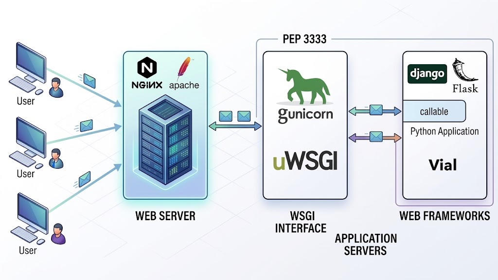

# 🧪 Vial
A simple Python Web Framework for building web applications.

---

**WSGI** (Web Server Gateway Interface) is simply a bridge or translator that lets Python web applications talk to web servers ([PEP 3333](https://peps.python.org/pep-3333/)).
In Python web development, we need WSGI because Python web applications cannot natively talk to traditional web servers like Nginx, Apache, or IIS.
Without a standard interface like WSGI, every web framework would need custom code for every web server, creating severe ecosystem fragmentation.

---

**How WSGI Works in Vial?** When a user sends an HTTP request to application:
1. The WSGI Server receives the incoming HTTP request.
2. The server constructs the environ dictionary and calls Vial application instance.
3. Vial parses the environ data, routes the request to the matching controller or handler, processes view logic, and prepares a response.
4. Vial invokes start_response(status, headers) and returns the response body as an iterable (typically a list of bytes).
5. The WSGI Server formats the raw HTTP response and sends it back to the client's browser.

#### Resources
- [PEP 3333 – Python Web Server Gateway Interface](https://peps.python.org/pep-3333/)
- [WebOb WSGI request and response objects](https://webob.org/)